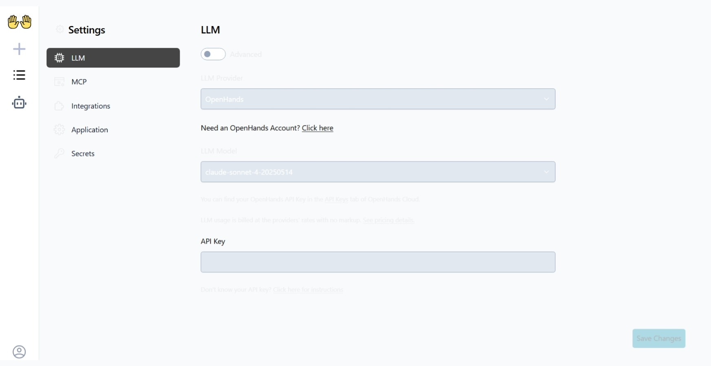

# Graph of Trace

## Introduction
**Graph of Trace** is a monitoring and visualization framework that records fine-grained execution events and organizes them into a directed graph that makes agent workflows explicit as they proceed.

**Features:**
- Real-time rendering
- MCP-enabled
- Agent trajectory level

This repo contains the complete Graph of Trace source code, as well as the packaged MCP tool `build_trace` and MCP server.

## Quick Start
**Our online demo is available [here](http://8.145.42.208:4500 "Graph of Trace Online Demo")**
1. Follow the demo link above, and you'll see a modified [OpenHands](https://docs.openhands.dev/overview/introduction) UI like this

2. Click on the user icon in the bottom-left corner to go to Settings. Then, select Large Language Model​ and enter your corresponding API key.

3. Go back to initial panel by clicking openhands icon in the top-left corner, and start a new conversation.
4. You can find Graph of Trace on the right side.

Here is a prompt example you can use when interacting with the agent:
```
Please base your analysis on the SEED dataset and complete the following research tasks under a consistent experimental and evaluation framework:
### Background and motivation：
1.Deep Learning method may behave better than traditional methods.
2.DE feature may carry more information in EEG decoding task.
3.How to select the critical channels and frequency bands and how to evaluate selected pools of electrodes have not been fully investigated yet.
### Research Goals：
1.Identify which EEG frequency bands carry the most discriminative information for three-class emotion recognition.
 Assess and compare emotion-classification performance using features extracted from individual frequency bands (delta, theta, alpha, beta, gamma), selected band combinations, and the full-band representation.

2.Determine whether a deep belief network provides a measurable advantage over shallow learning methods for EEG-based emotion recognition.
Compare the performance of a deep belief network with linear SVM, L2-regularised logistic regression, and k-nearest neighbors under identical data preprocessing, feature extraction, and evaluation protocols.

3.Identify which EEG feature set conveys the most discriminative information for emotion classification.
Evaluate and compare power spectral density, differential entropy, and multiple asymmetry-based feature sets using session-level emotion-classification accuracy and variability across repeated experimental sessions.

4.Identify the minimal electrode montage that retains emotion-discrimination capability equivalent to the full 62-channel setup.
First, rank all EEG channels in descending order according to their information content. Then, progressively select the Top-4, Top-6, Top-9, Top-12, and the full 62-channel sets for experimental evaluation and comparative analysis.

```

## Notes
- You can adjust the layout​ by dragging​ and zooming on the canvas.
- Click on a node to view its details.


