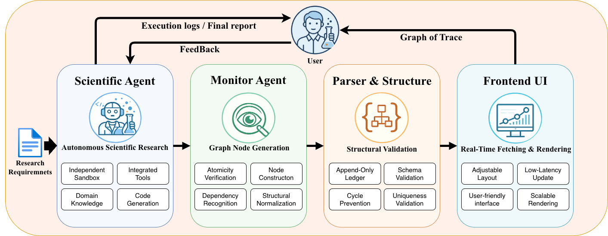
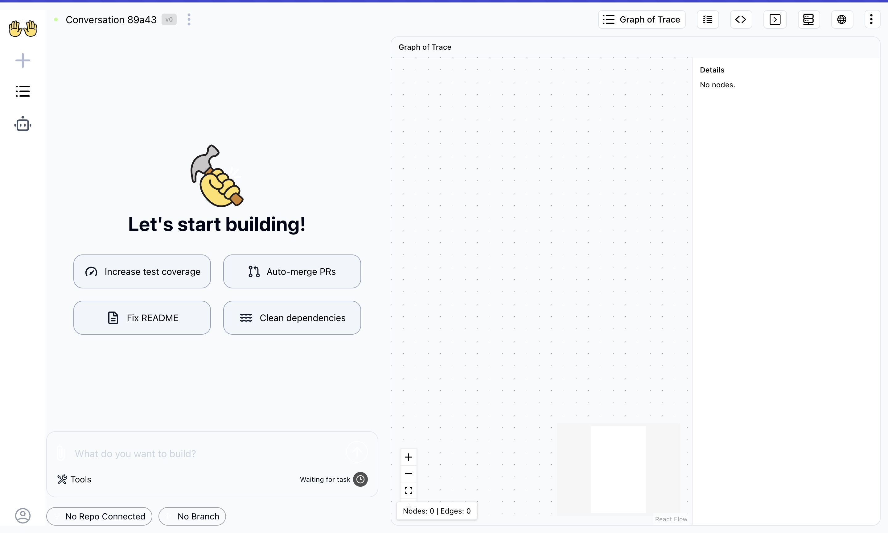

# Graph of Trace



**Graph of Trace** is an **agent-agnostic** monitoring and visualization framework
for scientific agents. It records fine-grained, user-verifiable execution events
and organizes them into a directed acyclic graph (DAG), making an agent's research
workflow explicit as it proceeds.

It ships as a single **MCP tool** (`build_trace`) plus an MCP server. Any
MCP-capable agent can call the tool after completing a subtask; the framework uses
an LLM to convert that subtask (and its artifacts) into GoT nodes and appends them
to a `got.json` file that a frontend can render in real time.

### ✨ Features
- **Agent-agnostic** — not tied to any specific agent framework; the output
  location is fully configurable.
- **Real-time rendering** — `got.json` is updated incrementally as the agent works.
- **MCP-native** — exposed as a standard MCP tool, so any MCP host can use it.
- **Trajectory level** — captures the research trajectory (experiments, analyses,
  conclusions), not raw chain-of-thought.

> The visualization frontend is included as a standalone viewer under
> [`frontend/`](#frontend-viewer) — it renders any `got.json` and needs no
> specific agent. The [`got.json` schema](#gotjson-schema) is the integration
> contract for any other frontend.

## How it works

```
  ┌─────────────┐   build_trace (MCP)   ┌──────────────┐   LLM extracts    ┌───────────┐
  │  Your agent  │ ────────────────────▶ │  MCP server   │ ────nodes──────▶ │ got.json   │
  │ (any MCP host)│   subtask + artifacts │ (this repo)   │   (DAG nodes)    │  (DAG)     │
  └─────────────┘                        └──────────────┘                   └─────┬─────┘
                                                                                   │ same path
                                                                             ┌─────▼─────┐
                                                                             │  Frontend  │
                                                                             └───────────┘
```

1. Your agent completes a verifiable subtask (install, implement, run, plot,
   analyze, conclude…).
2. It calls the `build_trace` MCP tool with the subtask, optional dependency hints,
   and artifacts.
3. The server asks an LLM to turn the subtask into one or more GoT DAG nodes and
   appends them to `got.json` (file-locked + atomic write).
4. A frontend reads the **same configured path** and renders the graph.

## Quickstart (server + viewer together)

One script launches the MCP server and the frontend viewer, wired so the server
writes `got.json` straight into the viewer's served directory:

```bash
scripts/start.sh
```

- MCP server starts (default: streamable-http on `127.0.0.1:8000`).
- Viewer opens on `http://localhost:4500` and live-updates as the agent records subtasks.
- The server is pointed at `frontend/public/got.json` via `GOT_OUTPUT_BASE_DIR`.

Override with env, e.g. `GOT_TRANSPORT=sse GOT_PORT=9000 GOT_UI_PORT=4500 scripts/start.sh`.
Prerequisites: Python deps installed (`pip install -e .`) and Node.js for the viewer
(the script runs `npm install` on first use).

## Install

Requires Python ≥ 3.10.

```bash
pip install -e .
# or, without packaging:
pip install mcp httpx pydantic pyyaml
```

## Configure

All configuration lives in `Monitor/config/config.yaml`. Create
`Monitor/config/local.yaml` to override any value locally (it is git-ignored and is
the right place for secrets). `${ENV_VAR}` substitution is supported everywhere.

**1. LLM provider** (used to extract nodes from subtasks):

```yaml
runtime:
  active_provider: "openai"   # openai | deepseek | azure
  active_api: "default"

providers:
  openai:
    api_key: "${OPENAI_API_KEY}"
    apis:
      default:
        api_base: "https://api.openai.com/v1"
        model: "gpt-4.1-mini"
```

**2. Output location** — point this at wherever your agent/frontend reads from:

```yaml
output:
  base_dir: "~/.graph_of_trace"
  path_template: "{base_dir}/{project_name}/{session_id}/got.json"
```

`path_template` placeholders: `{base_dir}`, `{project_name}`, `{session_id}`.
The frontend **must** resolve `got.json` using the same template so it can find the
file the backend writes.

## Run

```bash
export OPENAI_API_KEY=sk-...
python server.py
```

This starts the MCP server exposing the `build_trace` tool. By default it uses
the **stdio** transport, which is what most desktop/CLI hosts expect.

### Transports

The server supports all three MCP transports. Select via `--transport` (or the
`GOT_TRANSPORT` env var); `--host`/`--port` (or `GOT_HOST`/`GOT_PORT`) apply to the
network transports.

```bash
# stdio (default) — for Claude Desktop, Claude Code, most agent CLIs
python server.py

# Streamable HTTP — endpoint at http://<host>:<port>/mcp
python server.py --transport streamable-http --host 127.0.0.1 --port 8000

# SSE — endpoint at http://<host>:<port>/sse
python server.py --transport sse --host 127.0.0.1 --port 8000
```

| Transport         | Endpoint        | Typical use                                  |
|-------------------|-----------------|----------------------------------------------|
| `stdio`           | (process pipes) | Desktop apps, CLIs that spawn the server     |
| `streamable-http` | `/mcp`          | Remote/long-running server, HTTP hosts       |
| `sse`             | `/sse`          | Hosts that only speak the older SSE transport |

## Integrate with your agent

`build_trace` takes a session-wide `project.name` and `session.id` (keep them
consistent across calls within one run), plus exactly **one** completed `subtask`
and its `artifacts`. Each call records one executable, verifiable step.

```jsonc
{
  "project": { "name": "eeg-emotion" },
  "session": { "id": "run-2026-06-12" },
  "subtask": {
    "title": "Train ResNet-18 baseline on SEED",
    "description": "seed=42, batch_size=128, SGD lr=0.1, 50 epochs",
    "depends_on": ["Acquired SEED dataset"]   // optional natural-language hints
  },
  "artifacts": [ { "path": "metrics.json", "type": "json" } ]
}
```

See the tool docstring in `tool.py` for the full guidance on what counts as a node
(experiments, ablations as sibling nodes, analyses, conclusions) and what does not
(typo fixes, trivial reruns).

For a remote or shared deployment, run the server over HTTP/SSE and point the host
at the URL instead of spawning a process:

```python
from mcp import ClientSession
from mcp.client.streamable_http import streamablehttp_client

async with streamablehttp_client("http://127.0.0.1:8000/mcp") as (r, w, _):
    async with ClientSession(r, w) as s:
        await s.initialize()
        await s.call_tool("build_trace", {"payload": {...}})
```

### Example: OpenHands

OpenHands is **one** example host. Register this MCP server, then set
`path_template` to match OpenHands' workspace layout, e.g.:

```yaml
output:
  base_dir: "/srv/openhands"
  path_template: "{base_dir}/{project_name}/.openhands/got/{session_id}/got.json"
```



## Frontend viewer

A standalone React + ReactFlow viewer lives in [`frontend/`](./frontend). It
renders any `got.json` as a DAG (Dagre layered or D3-force layout), with a node
details panel, drag/zoom, and adaptive polling for live updates. It has no
dependency on any specific agent.

```bash
cd frontend
npm install
npm run dev      # opens on http://localhost:4500
```

By default it loads `frontend/public/got.json` (a sample is included). Point it at
your own data without rebuilding:

- `?src=<url>` query param, e.g. `http://localhost:4500/?src=/api/conversations/<id>/got`
- or `VITE_GOT_URL` env at build time
- or replace `public/got.json` / serve your file at `./got.json`

The viewer expects exactly the [`got.json` schema](#gotjson-schema) below, so it
works with the file the backend writes to the configured `output.path_template`
(serve that file over HTTP, or copy it to `public/got.json`).


## `got.json` schema

The backend writes a single JSON document per session. This is the contract for any
frontend or downstream tool.

```jsonc
{
  "meta": { "project_name": "...", "session_id": "..." },
  "nodes": [
    {
      "id": "N001",                  // "N" + zero-padded number; N001 is the root
      "title": "...",
      "description": "...",
      "status": "...",               // optional
      "parents": [                   // ≥1 parent; the root points at itself
        { "id": "N001", "relation": "necessitated_by", "explanation": "..." }
      ],
      "artifacts": [ { "path": "...", "type": "..." } ]
    }
  ]
}
```

- `parents[].relation` currently has one value: `necessitated_by` (logical
  prerequisite, not chronological order).
- Parallel experiments/variants share a parent and form sibling nodes (no false
  chaining).
- Redundant transitive parents are pruned automatically.

## Tests

A smoke test exercises the full write path with no LLM/network call:

```bash
python -m pytest tests/ -q
```

## Demo

A demo video is included (`demo.mp4`). An online demo (an OpenHands integration
example) may be available at the project page; treat it as an illustration of one
host, not a requirement.

## License

MIT — see [LICENSE](./LICENSE).
